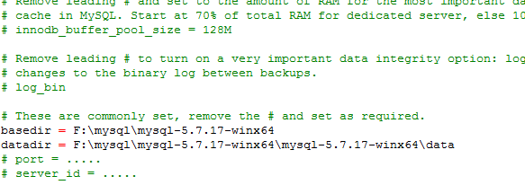
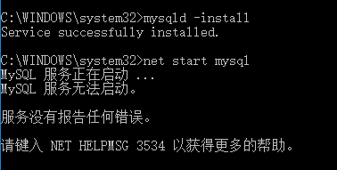
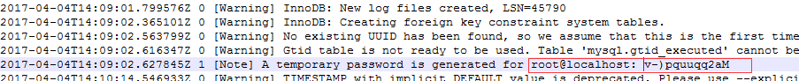
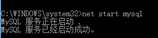
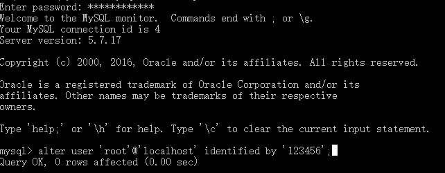

> 正所谓前人栽树，后人乘凉。
> 感谢[Huxpro](https://github.com/huxpro)提供的博客模板
> [我的的博客](http://my.happy-coding.cn)

## 下载mysql安装包
下载地址：
```
https://dev.mysql.com/downloads/file/?id=467269
```
打开网址，点击红框内容（英语我不太懂什么意思）直接下载
下载完成后，你会发现是zip文件，如果是安装版的mysql.格式应该是msi


## 配置
> 解压mysql压缩包，我这里将文件放在了F盘

> 在解压的文件中创建一个data文件夹（初始化时用于存放mysql数据的，后期添加的数据库也会放在里面）

> 复制my-default.ini文件，重命名为my.ini,修改里面内容如下：
- basedir------------mysql地址
- datadir-------------存放数据地址
- port----------------指定mysql的端口（默认3306）
- server_id-----------不太清楚用的场景（这里默认不开启）

> 配置环境mysql环境变量，找到系统变量中的path,在里面追加mysql解压包的地址
```F:\mysql\mysql-5.7.17-winx64\mysql-5.7.17-winx64\bin```

>打卡cmd管理员窗口（这里需要用管理员权限打开，不然后面初始化mysql数据库时会出错，同时找不到初始化密码）

> 正式安装mysql
```
cd F:\mysql\mysql-5.7.17-winx64\mysql-5.7.17-winx64\bin

mysqld -install
```


如果出现这种情况，说明mysql安装失败了，需要重新安装，重新安装需要清空data文件夹里面的内容
继续初始化mysql
mysqld --initialize(执行完成后，data文件下会生成很多东西，这个是自动初始化生成root帐号无密码)
mysqld --initialize-insecure（自动生成root帐号随机密码）
如果生成随机密码，需要在data文件下找到随机的密码，在data文件夹下找到err后缀的文件并打开


## 启动mysql
```
net start mysql ------------启动
net stop mysql ------------关闭
```


## 启动成功后，登录mysql
```
mysql -u root -p
```
执行上面指令后，需要输入密码，如果上面初始化时生成的是无密码的root帐号，则直接确认跳过就ok了
如果不是，就按照上面方法找到的随机密码输入即可


出现这个，说明登录成功，然后你就可以使用mysql了
我这里将root的帐号的密码修改成了123456（这里都是mysql的指令，我就不详细说明了）

```alter user 'root'@'localhost' identified by '123456';```

PS:如果你想将你的mysql中的某个数据库提供给其他人使用，就需要开放它的权限了，这里我创建了一个db_wuhuan的数据，同时创建了一个wh的帐号
首先你需要开放root的权限，然后开放创建用户的权限

```
create database db_wuhuan
GRANT all privileges ON *.* to root@ IDENTIFIED BY "123456";
GRANT all privileges ON *.* to wh@ IDENTIFIED BY "wh";
```
这样完成后就可以让其他人使用了。。。。。。。。


